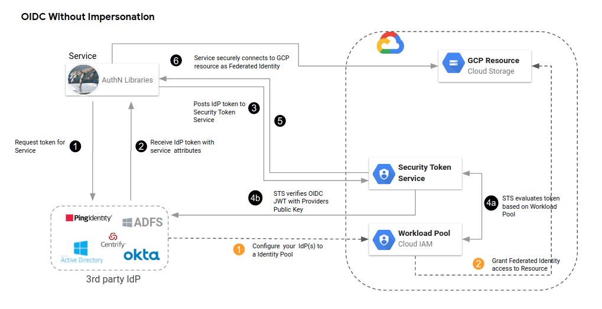
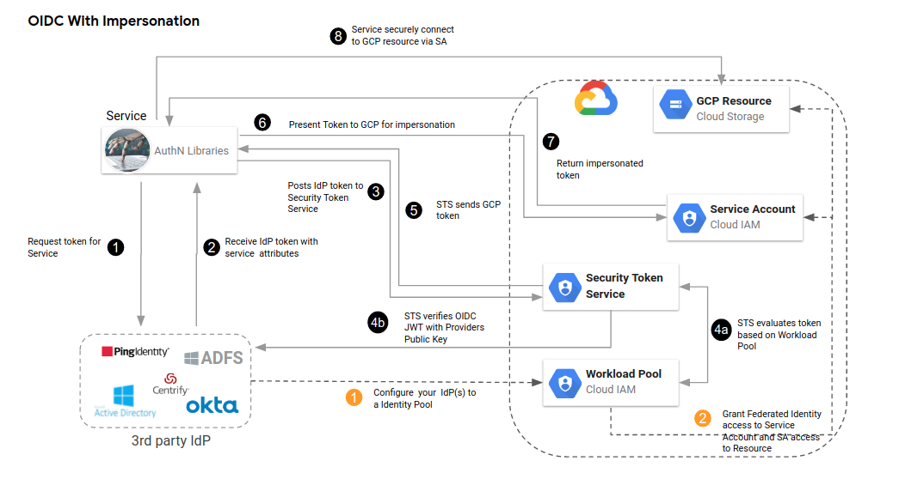

## SignedURL with GCP Workload Identity Federation

Code samples for generating [GCS SignedURL](https://cloud.google.com/storage/docs/access-control/signed-urls) using [workload identity federation](https://cloud.google.com/iam/docs/workload-identity-federation) on GKE and as a stand-alone application.

Workload Federation on GCP is essentially a two step process where an ambient non-gcp credential (OIDC, AWS or Azure token) is exchanged with GCP to first acquire a "federated token" which is then again used to get a GCP `access_token` represnting a GCP service Account.

A lesser known detail is that virtually all GCP services can "just use" the first federated token as-is directly against a resource.

In the case of `SignedURL` whats needed is an actual GCP service account which performs the signing using its private key.  For workload federation, the API the federated token will call is a backing serviceAccount's [iamcredentials.SignBLob()](https://pkg.go.dev/google.golang.org/api/iamcredentials/v1#ProjectsServiceAccountsSignBlobCall) endpoint which acts as a proxy for the privte key.

This repo shows how to issue signedURLs for standalone workload federation application running onprem using the federated token and the specific case for GKE Workload federation which essentially surfaces the same metadata-based signing as you would here:  [Google Cloud Storage SignedURL with Cloud Run, Cloud Functions and GCE VMs](https://github.com/salrashid123/gcs_signedurl)

---

>> this code is not supported by google.

For more background, see:

* [Understanding workload identity federation](https://blog.salrashid.dev/articles/2021/understanding_workload_identity_federation/)

The following shows using the abridged "Federated Token" directly aginst a GCP resource:



while the following takes the additional step to exchange the fedearted token for a service account and access a GCP resource:



also see

- [GCP Workload Identity Federation using OIDC Credentials](https://blog.salrashid.dev/articles/2020/gcpcompat-oidc/#using-federated-or-iam-tokens)
- [GCP Workload Identity Federation using SAML Credentials](https://blog.salrashid.dev/articles/2020/gcpcompat-saml)
- [GCP Workload Identity Federation using AWS Credentials](https://blog.salrashid.dev/articles/2020/gcpcompat-aws)

- [Using Kubernetes Service Accounts for Google Workload Identity Federation](https://github.com/salrashid123/k8s_federation_with_gcp)

- [GCS signedURLs and GCP Authentication with Trusted Platform Module](https://github.com/salrashid123/gcs_tpm)

- [Using ImpersonatedCredentials for Google Cloud APIs and IDTokens](https://github.com/salrashid123/gcp_impersonated_credentials#workload-identity-federation-oidc)
- [Concentric IAMCredentials Permissions: The secret life of signBlob](https://blog.salrashid.dev/articles/2022/concentric_iam/)

- [GCE Metadata Server Emulator](https://github.com/salrashid123/gce_metadata_server)

---

### Setup

Before we get started, note that this tutorial as-is uses a 'Fake OIDC' server on clould run:

* [DIY OIDC Server](https://github.com/salrashid123/diy_oidc) adapted for workload federation [here](https://gist.github.com/salrashid123/677866e42cf2785fe885ae9d6130fc21)

The OIDC tokens issued by this server is signed by a static keypair available at a [public endpoint](https://idp-on-cloud-run-3kdezruzua-uc.a.run.app/.well-known/openid-configuration).  This means if you configure this tutorial as-is, you'll *really want to* unwind/disable the Workload Federation provider.


```bash
export PROJECT_ID=`gcloud config get-value core/project`
export PROJECT_NUMBER=`gcloud projects describe $PROJECT_ID --format='value(projectNumber)'`

gcloud  iam workload-identity-pools create fake-oidc-pool-1 \
    --location="global" \
    --description="Fake OIDC Pool " \
    --display-name="Fake OIDC Pool" --project $PROJECT_ID

# the issuer specified below is the default deployment described in `diy_oidc` repo:
gcloud  iam workload-identity-pools providers create-oidc fake-oidc-provider-1 \
        --workload-identity-pool="fake-oidc-pool-1" \
        --issuer-uri="https://idp-on-cloud-run-3kdezruzua-uc.a.run.app" \
        --location="global" \
        --attribute-mapping="google.subject=assertion.sub,attribute.isadmin=assertion.isadmin,attribute.aud=assertion.aud" \
        --attribute-condition="attribute.isadmin=='true'" --project $PROJECT_ID

gcloud iam service-accounts create urlsigner
export SA_EMAIL=urlsigner@$PROJECT_ID.iam.gserviceaccount.com
echo $SA_EMAIL

git clone https://github.com/salrashid123/diy_oidc.git
cd diy_oidc

export URL="https://idp-on-cloud-run-3kdezruzua-uc.a.run.app"
export IAT=`date -u +%s`
export EXP=`date -u +%s -d "+3600 seconds"`
export EMAIL="alice@domain.com"
export SUB="alice@domain.com"
export ISS=$URL
export NAME="alice"
export AUD="https://iam.googleapis.com/projects/$PROJECT_NUMBER/locations/global/workloadIdentityPools/fake-oidc-pool-1/providers/fake-oidc-provider-1"
# configure the json oidc token to genrate;  you need to have the envsubst utility installed
envsubst < "templates/jwt.tmpl" > "/tmp/jwt.json"

# simply post the JSON Claims to get the oidc token
export JWT_TOKEN=`curl -s -X POST -d @/tmp/jwt.json  $URL/token?kid=rsaKeyID_1`
echo $JWT_TOKEN

# write it to the file ADC will read
echo $JWT_TOKEN > /tmp/oidccred.txt

# create the ADC config file
cd ..
## for use with federated token alone
envsubst < "sts-creds_federate.tmpl" > "/tmp/sts-creds_federate.json"
## for use with federate then impersonate SA
envsubst < "sts-creds_self.tmpl" > "/tmp/sts-creds_self.json"
```

note the `sts-creds_federate.tmpl` file shown below specifies the credential file from above

```json
{
  "type": "external_account",
  "audience": "//iam.googleapis.com/projects/$PROJECT_NUMBER/locations/global/workloadIdentityPools/fake-oidc-pool-1/providers/fake-oidc-provider-1",
  "subject_token_type": "urn:ietf:params:oauth:token-type:jwt",
  "token_url": "https://sts.googleapis.com/v1/token",
  "credential_source": {
    "file": "/tmp/oidccred.txt"
  }
}
```

`sts-creds_federate.tmpl` config intentionally omits the `service_account_impersonation_url` value which automatically exchanges the Federated Token for a GCP service account `access_token` for a target service account:

```json
"service_account_impersonation_url": "https://iamcredentials.googleapis.com/v1/projects/-/serviceAccounts/urlsigner@$PROJECT_ID.iam.gserviceaccount.com:generateAccessToken"
```

If we omit the `service_account_impersonation_url`, ADC will return just the federated token:

```bash
export GOOGLE_APPLICATION_CREDENTIALS=/tmp/sts-creds_federate.json"

$ gcloud auth application-default print-access-token
 ya29.d.b0Aaekm1JkRm9Oei...
```

this token does not itself represent any service account but a federated identity like this which can be bound to an resource via IAM policy:

```
principal://iam.googleapis.com/projects/$PROJECT_NUMBER/locations/global/workloadIdentityPools/fake-oidc-pool-1/subject/alice@domain.com
```
---

### Signed URL using Federated Token

The following snippets generates signedURLs using federated identity alone.

THe federated identity needs to impersonate the target service account so the IAM binding required for self-impersonation is:

```bash
export PRINCIPAL=iam.googleapis.com/projects/$PROJECT_NUMBER/locations/global/workloadIdentityPools/fake-oidc-pool-1/subject/alice@domain.com

gcloud iam service-accounts  add-iam-policy-binding  \
 --role=roles/iam.serviceAccountTokenCreator  \
 --member=principal://$PRINCIPAL $SA_EMAIL
```

>> **NOTE** in each of the code snippets below, remember to edit the code and replace the value for the service account email value

#### golang

In golang, if the `GoogleAccessID` [storage.SignedURLOptions](https://pkg.go.dev/cloud.google.com/go/storage#SignedURLOptions) parameter is specified, the raw token ADC returns will be used to call the `IAMCredentials.SignBlob()` API endpoint automatically.  This means that unlike the other language examples in this repo, you don't have to take the federated token to manually call the IAM api on your own.  As long as the federated token has permissions to invoke the signblob endpoint, a signed url will be generated. 

For more information, see [Credential requirements for signing](https://pkg.go.dev/cloud.google.com/go/storage#hdr-Credential_requirements_for_signing)

```bash
# remember to edit main.go and specify you own service account name
go run main.go
```

#### python

```bash
virtualenv env
source env/bin/activate
pip install -r requirements.txt
# remember to edit main.py and specify you own service account name
python main.py
```

#### java

```bash
# remember to edit TestApp.java and specify you own service account name
mvn clean install exec:java -q
```

#### nodejs

pending [https://github.com/googleapis/google-auth-library-nodejs/issues/1443](https://github.com/googleapis/google-auth-library-nodejs/issues/1443)

### Signed URL using Federated Token and self-impersonation

If you do have a situation where the final impersonation step is performed automatically (i.,e. when `service_account_impersonation_url` is present), then signing a url requires two bindings:

The federated identity needs to impersonate the target service account a so the IAM binding required is as described [here](https://cloud.google.com/iam/docs/workload-identity-federation#impersonation)

```bash
export PRINCIPAL=iam.googleapis.com/projects/$PROJECT_NUMBER/locations/global/workloadIdentityPools/fake-oidc-pool-1/subject/alice@domain.com

# can also use roles/iam.workloadIdentityUser
gcloud iam service-accounts $SA_EMAIL \
    --role roles/iam.serviceAccountTokenCreator \
    --member "principal://$PRINCIPAL" 
```

A further IAM binding is needed to allow the target service account `$SA_EMAIL` to impersonate itself:

```bash
gcloud iam service-accounts  add-iam-policy-binding \
 --role=roles/iam.serviceAccountTokenCreator  \
 --member=serviceAccount:$SA_EMAIL $SA_EMAIL
```

then specify the ADC config file enabled for self-impersonation:

```bash
export GOOGLE_APPLICATION_CREDENTIALS=/tmp/sts-creds_self.json

gcloud auth application-default print-access-token
 ya29.d.b0Aaekm1JkRm9Oei...
```

this token would represent `$SA_EMAIL` service account

### Signed URL using GKE Workload Federation

With GKE, the token that is surfaced to an app within GKE is not the federated token but an `access_token` (the exchange for the federated token is done for you in the background) and the flows are similar to:

- [Google Cloud Storage SignedURL with Cloud Run, Cloud Functions and GCE VMs](https://github.com/salrashid123/gcs_signedurl).

As mentioned, in golang even with [GKE Workload Federation](https://cloud.google.com/kubernetes-engine/docs/how-to/workload-identity#authenticating_to), the two step authentication is *already* done for you can call the signblob directly once self-impersonation is enabled.

I'm using `urlsigner@$PROJECT_ID.iam.gserviceaccount.com ` here to represent `GSA_NAME@GSA_PROJECT.iam.gserviceaccount.com` for consistency in the docs:

```bash
docker build -t gcr.io/$PROJECT_ID/signurl .
docker push gcr.io/$PROJECT_ID/signurl

gcloud container clusters create cluster-1 \
    --region=us-central1 --num-nodes=1 \
    --workload-pool=$PROJECT_ID.svc.id.goog

gcloud container clusters get-credentials cluster-1 \
    --region=us-central1

kubectl create serviceaccount ksa1

gcloud iam service-accounts create urlsigner

gcloud iam service-accounts add-iam-policy-binding urlsigner@$PROJECT_ID.iam.gserviceaccount.com \
    --role roles/iam.workloadIdentityUser \
    --member "serviceAccount:$PROJECT_ID.svc.id.goog[default/ksa1]"

kubectl annotate serviceaccount ksa1 \
    iam.gke.io/gcp-service-account=urlsigner@$PROJECT_ID.iam.gserviceaccount.com

# allow self-impersonation
gcloud iam service-accounts  add-iam-policy-binding \
 --role=roles/iam.serviceAccountTokenCreator  \
 --member=serviceAccount:urlsigner@$PROJECT_ID.iam.gserviceaccount.com urlsigner@$PROJECT_ID.iam.gserviceaccount.com 

# deploy
envsubst < "fe-deployment.tmpl" > "/tmp/fe-deployment.yaml"
kubectl apply -f /tmp/fe-deployment.yaml

gcloud compute firewall-rules create fw-gke  --allow=tcp:8080 --destination-ranges=0.0.0.0/0

kubectl get svc,po

## use EXTERNAL-IP

curl -v http://$EXTERNAL-IP:8080/
```

Once you do this, you application will have to manually invoke the IAM api to sign the url.  
